# Forgemux — Technical Design

**Document type:** Technical Design
**Author:** Silverpond Engineering
**Date:** February 2026
**Status:** Draft
**Language:** Rust (2024 edition)

---

## Overview

Forgemux is composed of three deployable binaries and a browser-based frontend. All backend components are written in Rust. The system is designed around a clear separation between the **edge** (where agent sessions execute) and the **hub** (where aggregation, API, and dashboard live). Communication between edge and hub flows over an authenticated, encrypted channel that can traverse NAT, VPN, or direct LAN.

```
┌─────────────────────────────────────────────┐
│                   Hub                        │
│  ┌──────────┐  ┌──────────┐  ┌───────────┐  │
│  │ Hub API  │  │ Dashboard │  │ Event     │  │
│  │ (REST/WS)│  │ (SPA)    │  │ Store     │  │
│  └──────────┘  └──────────┘  └───────────┘  │
└──────────────────┬──────────────────────────┘
                   │  gRPC / WebSocket
        ┌──────────┴──────────┐
        ▼                     ▼
┌──────────────┐     ┌──────────────┐
│  Edge Node A │     │  Edge Node B │
│  ┌────────┐  │     │  ┌────────┐  │
│  │ forged │  │     │  │ forged │  │
│  └────────┘  │     │  └────────┘  │
│  ┌─┐ ┌─┐ ┌─┐│     │  ┌─┐ ┌─┐    │
│  │S│ │S│ │S││     │  │S│ │S│    │
│  └─┘ └─┘ └─┘│     │  └─┘ └─┘    │
└──────────────┘     └──────────────┘
   S = agent session (tmux + sidecar)
```

---

## Binaries

| Binary | Role | Runs on |
|---|---|---|
| `fmux` | CLI for engineers — start, attach, list, terminate sessions, manage Foreman | Engineer workstation |
| `forged` | Edge daemon — manages session lifecycle (including Foreman sessions), hosts WebSocket bridge, reports to hub | Edge node |
| `forgehub` | Hub server — aggregates state, serves API and dashboard | Central server |

---

## System Architecture

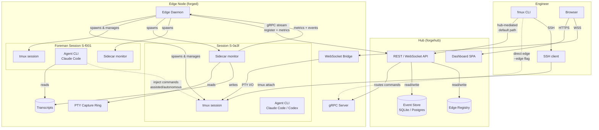

---

## Session Lifecycle State Machine

Every session is modelled as a finite state machine. State transitions are events persisted to the event store.

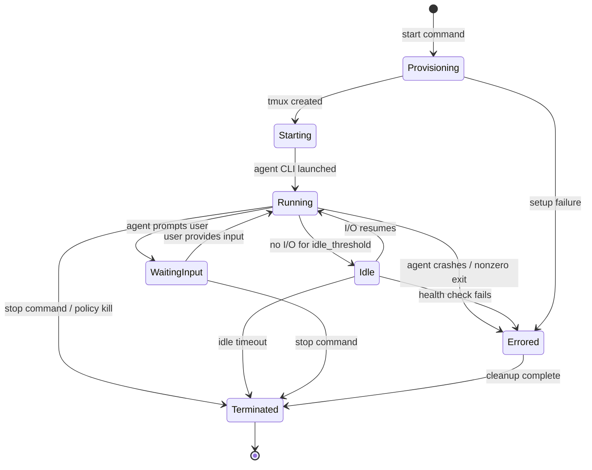

**State definitions:**

| State | Meaning |
|---|---|
| `Provisioning` | tmux session being created, environment prepared |
| `Starting` | Agent CLI process launching inside tmux |
| `Running` | Agent is active, producing output |
| `Idle` | No terminal I/O for configurable threshold (default 60s) |
| `WaitingInput` | Agent has prompted and is blocked on user input |
| `Errored` | Agent process exited nonzero or health check failed |
| `Terminated` | Session cleaned up; tmux session destroyed |

---

## Component Design

### 1. `fmux` — Engineer CLI

A thin client that resolves an edge node and issues commands. Supports two modes of operation: hub-mediated (default) and direct edge. The binary is named `fmux` for brevity — the product is Forgemux.

**Edge resolution model:**

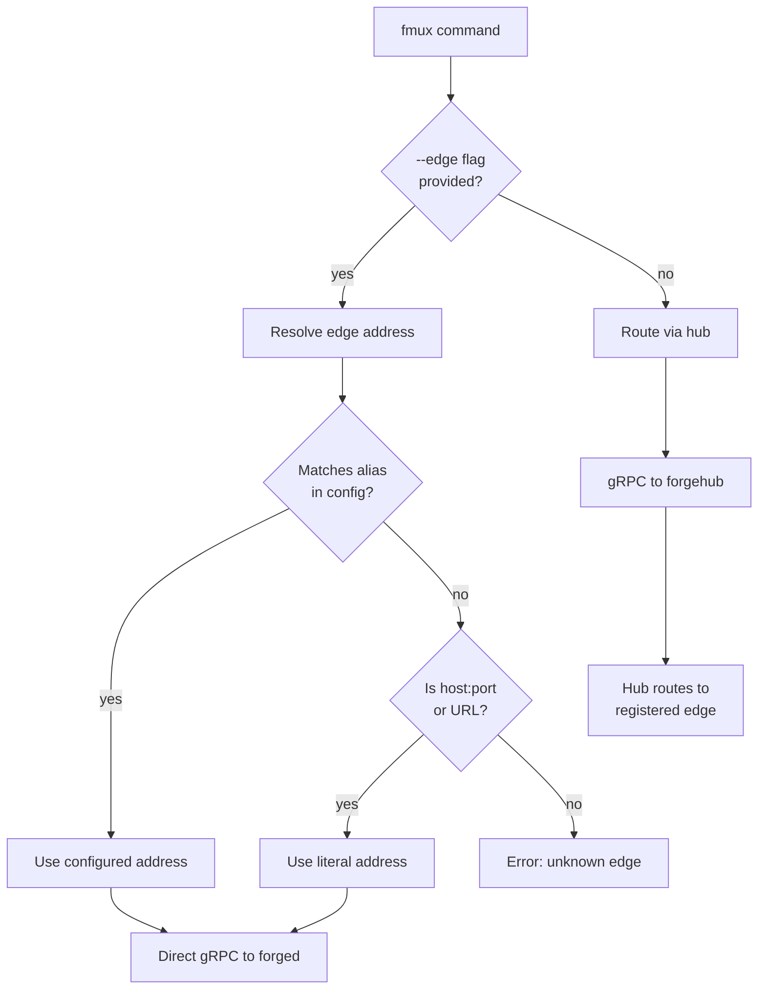

**Hub-mediated mode (default).** The CLI sends all commands to `forgehub`. The hub maintains a live registry of connected edge nodes (populated by `forged` instances on startup). The hub selects or routes to the appropriate edge. Engineers never need to know edge addresses.

```bash
# Hub picks an available edge
fmux start --agent claude --repo .

# Hub routes to the edge that owns this session
fmux attach S-0a3f
```

**Direct edge mode.** The CLI connects directly to a `forged` instance, bypassing the hub. Useful for single-node setups, LAN development, offline environments, or when the hub is unreachable. Edges can be specified as a configured alias or a literal address.

```bash
# Using a named alias from ~/.config/forgemux/config.toml
fmux --edge mel-01 start --agent claude

# Using a literal address
fmux --edge 192.168.1.50:9443 start --agent claude

# Using a Tailscale hostname
fmux --edge edge-mel-01.tailnet:9443 start --agent claude
```

**Subcommands:**

```
USAGE: fmux [OPTIONS] <COMMAND>

GLOBAL OPTIONS:
    --edge <alias|host:port>    Connect directly to edge (bypass hub)
    --hub <url>                 Override hub URL from config
    --config <path>             Config file [default: ~/.config/forgemux/config.toml]
    --format <text|json>        Output format [default: text]
    -v, --verbose               Increase log verbosity (-vv for debug)
    -q, --quiet                 Suppress non-essential output

SESSION COMMANDS:
    start                       Start a new agent session
    attach <session-id>         Attach to a running session
    detach <session-id>         Detach all clients from a session
    stop <session-id>           Gracefully terminate a session
    kill <session-id>           Force-kill a session immediately

QUERY COMMANDS:
    ls                          List sessions
    status <session-id>         Show detailed session state
    logs <session-id>           View session transcript
    usage [session-id]          Show token usage and cost

EDGE COMMANDS:
    edges                       List registered edge nodes
    edge-status <edge-id>       Show edge node health and capacity

FOREMAN COMMANDS:
    foreman start               Start a Foreman session on an edge node
    foreman status              Show Foreman session state and latest report
    foreman report              Print the Foreman's most recent supervision report
    inject <session-id> <cmd>   Inject a command into a session's tmux input

UTILITY COMMANDS:
    config                      Show resolved configuration
    completions <shell>         Generate shell completions (bash|zsh|fish)
    version                     Show version, build, and commit info
    help [command]              Show help for a command
```

**Command details:**

```
fmux start [OPTIONS]
    --agent <name>              Agent type [default: claude] (claude|codex)
    --model <model>             Model preset (e.g. sonnet, opus, o3)
    --repo <path>               Working directory [default: .]
    --edge <alias|host:port>    Target edge node
    --policy <name>             Apply named policy from edge config
    --env KEY=VAL               Extra env vars passed to agent (repeatable)
    --timeout <duration>        Idle timeout override (e.g. 1h, 30m)
    --name <label>              Human-readable session label
    --no-attach                 Start session without attaching

fmux attach <session-id> [OPTIONS]
    --mode <ssh|web>            Attach mode [default: ssh]
    --read-only                 View-only attach (no input)

fmux ls [OPTIONS]
    --edge <alias|host:port>    Filter by edge node
    --state <state>             Filter by state (running|idle|waiting|errored)
    --agent <name>              Filter by agent type
    --mine                      Show only my sessions
    --all                       Show terminated sessions too
    --sort <field>              Sort by: created, updated, cost, tokens [default: updated]
    --limit <n>                 Max results [default: 50]

fmux logs <session-id> [OPTIONS]
    --follow, -f                Stream live output
    --tail <n>                  Show last n lines [default: 100]
    --since <duration>          Show logs since (e.g. 5m, 1h)
    --raw                       Include ANSI escape sequences

fmux usage [OPTIONS]
    <session-id>                Usage for a specific session
    --edge <alias|host:port>    Aggregate by edge
    --since <duration>          Time window (e.g. 24h, 7d)
    --by <session|agent|model>  Group by dimension [default: session]

fmux foreman start [OPTIONS]
    --edge <alias|host:port>    Target edge node
    --agent <name>              Agent for Foreman to use [default: claude]
    --model <model>             Model [default: sonnet]
    --watch <scope>             Sessions to watch: "all" or comma-separated IDs [default: all]
    --intervention <level>      advisory|assisted|autonomous [default: advisory]
    --cycle <duration>          Review interval [default: 5m]

fmux foreman status [OPTIONS]
    --edge <alias|host:port>    Target edge node
    Shows: Foreman session state, watched sessions, last report time,
           intervention level, own token usage

fmux foreman report [OPTIONS]
    --edge <alias|host:port>    Target edge node
    --format <text|json>        Output format [default: text]
    Prints the Foreman's most recent structured supervision report

fmux inject <session-id> <command> [OPTIONS]
    --confirm                   Skip confirmation prompt
    Injects a command into the target session's tmux input via send-keys.
    Logged as a lifecycle event. Requires operator role or Foreman actor.

fmux version
    Prints: fmux 0.1.0 (abc1234 2026-02-25) forgemux-proto v1
```

When `--edge` is omitted, all commands route through the hub. When `--edge` is provided, the CLI connects directly to that `forged` instance.

**Key crates:**

| Crate | Purpose |
|---|---|
| `clap` | Argument parsing and subcommand routing |
| `tonic` | gRPC client for edge daemon and hub communication |
| `reqwest` | HTTP client for REST fallback |
| `tokio` | Async runtime |
| `tabled` | Terminal table formatting for `ls` and `status` output |
| `crossterm` | Terminal manipulation for attach passthrough |

### 2. `forged` — Edge Daemon

The core of the system. Runs as a long-lived daemon on each edge node. Manages all sessions on that node.

**Subcommands:**

```
USAGE: forged [OPTIONS] <COMMAND>

GLOBAL OPTIONS:
    --config <path>             Config file [default: /etc/forgemux/forged.toml]
    -v, --verbose               Increase log verbosity (-vv for debug)

SERVER COMMANDS:
    run                         Start daemon in foreground (for systemd/containers)
    serve                       Alias for run

SESSION COMMANDS:
    sessions                    List sessions on this node
    session <session-id>        Show session detail
    drain                       Stop accepting new sessions; wait for existing to finish
    kill-session <session-id>   Force-kill a session locally

DIAGNOSTICS:
    check                       Validate config, certs, tmux, and agent binaries
    health                      Print health status (JSON)
    status                      Show daemon status, uptime, session count
    hub-status                  Show hub connection state and last heartbeat

KEY MANAGEMENT:
    rotate-cert                 Reload TLS certs without restart

UTILITY:
    init                        Generate default config and directory structure
    version                     Show version, build, and commit info
    help [command]              Show help for a command
```

**Command details:**

```
forged run [OPTIONS]
    --bind <addr:port>          Override gRPC listen address
    --ws-bind <addr:port>       Override WebSocket listen address
    --no-hub                    Run standalone without hub registration
    --pid-file <path>           Write PID file

forged check [OPTIONS]
    --fix                       Attempt to fix issues (create dirs, set permissions)
    Validates:
      ✓ Config file syntax and required fields
      ✓ TLS cert/key readable and not expired
      ✓ CA cert matches hub cert chain
      ✓ tmux binary present and version compatible
      ✓ Agent binaries (claude, codex) present in PATH
      ✓ API key files exist and are readable
      ✓ Data directory writable
      ✓ cgroup v2 delegation available (if limits configured)

forged sessions [OPTIONS]
    --state <state>             Filter by state
    --format <text|json>        Output format [default: text]

forged drain [OPTIONS]
    --timeout <duration>        Max wait time [default: 30m]
    --force                     Kill remaining sessions after timeout

forged health
    Prints JSON: { "status": "healthy", "sessions": 3, "hub": "connected",
                   "uptime": "2d 4h", "cpu": "12%", "memory": "1.2G/4G" }

forged version
    Prints: forged 0.1.0 (abc1234 2026-02-25) forgemux-proto v1
```

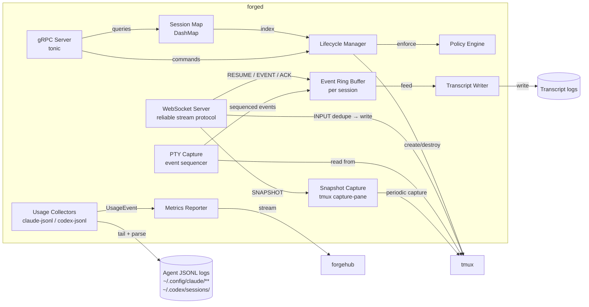

**Lifecycle Manager.** Spawns tmux sessions, launches agent CLIs inside them, starts sidecar monitors, and handles teardown. Uses `tokio::process::Command` to manage child processes. Communicates with tmux via the `tmux` CLI (not libtmux) to avoid ABI coupling.

**Session Map.** In-memory concurrent map (`DashMap<SessionId, SessionState>`) holding live session metadata. Persisted to disk on mutation for crash recovery.

**WebSocket Server.** Accepts authenticated WebSocket connections and bridges them to tmux PTY file descriptors using the reliable stream protocol. Output bytes are assigned monotonic event IDs and stored in a per-session ring buffer. Clients reconnect with `RESUME(last_seen_event_id)` and receive replayed events from the buffer. Input messages carry `input_id` for deduplication — the edge applies each input exactly once and returns `ACK`. Periodic snapshots (via `tmux capture-pane`) enable fast catch-up after large gaps.

**PTY Capture.** Each session has a dedicated capture thread that reads from the tmux PTY output (via `tmux pipe-pane` or direct PTY fd duplication). Output flows into the event ring buffer (sequenced, replayable), into the transcript writer (persistent), and to connected clients via the WebSocket server.

**Policy Engine.** Evaluates per-session policies (CPU, memory, network, filesystem, idle timeout) loaded from a TOML configuration. Enforced via cgroups v2 for resource limits and network namespaces for network isolation.

**Transcript Writer.** Appends raw terminal output to a per-session log file, with timestamps. Configurable rotation and compression.

**Metrics Reporter.** Periodically pushes session metrics to `forgehub` via a gRPC stream. Includes token usage (parsed from agent JSONL session logs on disk), CPU/memory (from cgroup stats), and session state.

**Key crates:**

| Crate | Purpose |
|---|---|
| `clap` | Argument parsing and subcommand routing |
| `tokio` | Async runtime, process management, timers |
| `tonic` | gRPC server and client (hub communication) |
| `warp` | HTTP server for WebSocket upgrade and health endpoints |
| `tokio-tungstenite` | WebSocket implementation |
| `dashmap` | Lock-free concurrent session map |
| `nix` | Unix syscalls — PTY operations, signal handling, cgroups |
| `serde` / `toml` | Configuration and session state serialisation |
| `tracing` / `tracing-subscriber` | Structured logging throughout |
| `ring` (custom) | Fixed-size ring buffer for PTY capture backpressure |
| `notify` | Filesystem watcher for config hot-reload |
| `uuid` | Session ID generation |
| `chrono` | Timestamps for events and transcripts |
| `rustls` | TLS for all network communication |

### 3. `forgehub` — Hub Server

Aggregates session state from all connected edge nodes. Serves the REST/WebSocket API and hosts the dashboard SPA.

**Subcommands:**

```
USAGE: forgehub [OPTIONS] <COMMAND>

GLOBAL OPTIONS:
    --config <path>             Config file [default: /etc/forgemux/forgehub.toml]
    -v, --verbose               Increase log verbosity (-vv for debug)

SERVER COMMANDS:
    run                         Start hub server in foreground
    serve                       Alias for run

DATABASE COMMANDS:
    db migrate                  Run pending migrations
    db status                   Show migration status
    db reset                    Drop and recreate (DESTRUCTIVE — requires --confirm)

EDGE MANAGEMENT:
    edges                       List registered edge nodes
    edge <edge-id>              Show edge node detail and health
    edge-deregister <edge-id>   Remove edge from registry (force)

SESSION MANAGEMENT:
    sessions                    List all sessions across edges
    session <session-id>        Show session detail
    kill-session <session-id>   Force-kill session (relayed to edge)

USER / AUTH MANAGEMENT:
    token create <label>        Create an API token (for CLI or CI)
    token ls                    List active tokens
    token revoke <token-id>     Revoke a token
    user ls                     List known users
    user grant <user> <role>    Grant role (viewer|operator|admin)
    user revoke <user> <role>   Revoke role

DIAGNOSTICS:
    check                       Validate config, certs, database, and connectivity
    health                      Print health status (JSON)
    status                      Show server status, edge count, session count

REPORTING:
    usage                       Aggregate usage report
    export <format>             Export event data (csv|json)

UTILITY:
    init                        Generate default config and directory structure
    version                     Show version, build, and commit info
    help [command]              Show help for a command
```

**Command details:**

```
forgehub run [OPTIONS]
    --bind <addr:port>          Override HTTP/gRPC listen address
    --db <url>                  Override database URL
    --no-dashboard              Disable static file serving for SPA
    --pid-file <path>           Write PID file

forgehub check [OPTIONS]
    --fix                       Attempt to fix issues (run migrations, create dirs)
    Validates:
      ✓ Config file syntax and required fields
      ✓ TLS cert/key readable and not expired
      ✓ Database reachable and migrations current
      ✓ Dashboard SPA assets present
      ✓ At least one edge connected (warning if none)

forgehub sessions [OPTIONS]
    --edge <edge-id>            Filter by edge node
    --state <state>             Filter by state
    --user <username>           Filter by user
    --since <duration>          Filter by time window
    --format <text|json>        Output format [default: text]

forgehub usage [OPTIONS]
    --since <duration>          Time window [default: 24h]
    --by <session|edge|user|agent|model>  Group by dimension
    --format <text|json|csv>    Output format [default: text]

forgehub export <csv|json> [OPTIONS]
    --since <duration>          Time window
    --output <path>             Output file [default: stdout]
    --type <events|usage|sessions>  Data type [default: events]

forgehub token create <label> [OPTIONS]
    --role <viewer|operator|admin>  Token role [default: operator]
    --expires <duration>        Expiry (e.g. 90d, 1y) [default: never]
    Prints: fmux_tok_a1b2c3d4e5f6...  (shown once, not stored in plaintext)

forgehub version
    Prints: forgehub 0.1.0 (abc1234 2026-02-25) forgemux-proto v1
```

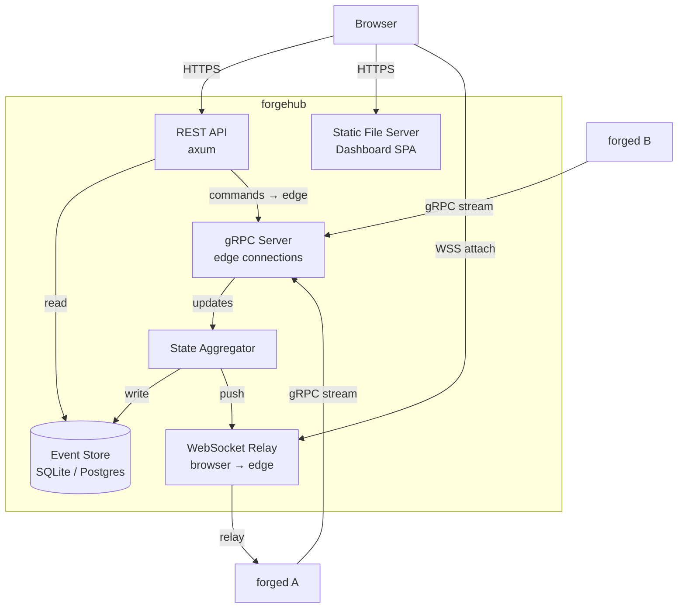

**State Aggregator.** Maintains an in-memory view of all sessions across all edges. Updated by inbound gRPC streams from `forged` instances. Pushes real-time updates to connected dashboard clients via WebSocket.

**Edge Registry.** Each `forged` instance registers with the hub on startup via a persistent gRPC stream that also carries session metrics. The hub maintains a live registry of connected edges — their node ID, advertise address, capacity, and health. When the CLI issues a command without `--edge`, the hub resolves the target edge from this registry (by session ownership for existing sessions, or by selection policy for new sessions).

**REST API.** Serves session listing, filtering, detail, and management endpoints. Used by both the dashboard and the CLI.

**WebSocket Relay.** For browser-based terminal attach, the hub relays the WebSocket connection to the appropriate edge node. The edge maintains an outbound gRPC tunnel to the hub, so the hub can relay without the client needing direct access to the edge — this is essential for mobile and NAT-traversed environments. Optionally, the hub can buffer output events while a client is disconnected (store-and-forward), making brief edge outages transparent to the client.

**Event Store.** Persists session lifecycle events, token usage records, and aggregated metrics. SQLite for single-hub deployments; Postgres for production/multi-instance.

**Key crates:**

| Crate | Purpose |
|---|---|
| `clap` | Argument parsing and subcommand routing |
| `axum` | HTTP framework for REST API and static file serving |
| `tonic` | gRPC server for edge daemon connections |
| `tokio-tungstenite` | WebSocket relay for browser-to-edge terminal attach |
| `sqlx` | Async database driver (SQLite and Postgres) |
| `serde` / `serde_json` | API serialisation |
| `tower` | Middleware (auth, rate limiting, CORS) |
| `tracing` | Structured logging |
| `jsonwebtoken` | JWT-based authentication for browser clients |
| `argon2` | API token hashing (tokens stored as hashes, never plaintext) |
| `csv` | Usage and event export |
| `rustls` | TLS termination |

### 4. Dashboard SPA

A browser-based single-page application served by `forgehub`. Not written in Rust — built with TypeScript and a lightweight framework.

**Key libraries:**

| Library | Purpose |
|---|---|
| `xterm.js` | Terminal emulator in the browser for session attach |
| `xterm-addon-fit` | Auto-resize terminal to container |
| `xterm-addon-webgl` | GPU-accelerated rendering for high-throughput sessions |
| SolidJS or Svelte | Reactive UI framework (minimal bundle, fast) |
| TailwindCSS | Styling |

### 5. Foreman Agent — Meta-Session Supervisor

The Foreman is not a separate system. It is a Forgemux session with elevated read access to other sessions. It runs a standard agent CLI (Claude Code or Codex CLI) with a supervision-oriented system prompt. It reasons about other sessions' state and transcripts using the same LLM capabilities any agent session has — it does not call LLM APIs directly.

**Why this matters architecturally:** the Foreman requires zero new infrastructure. It is managed by `forged` with the same lifecycle, observability, transcript capture, and policy enforcement as any work session. The only difference is its session role and its read permissions.

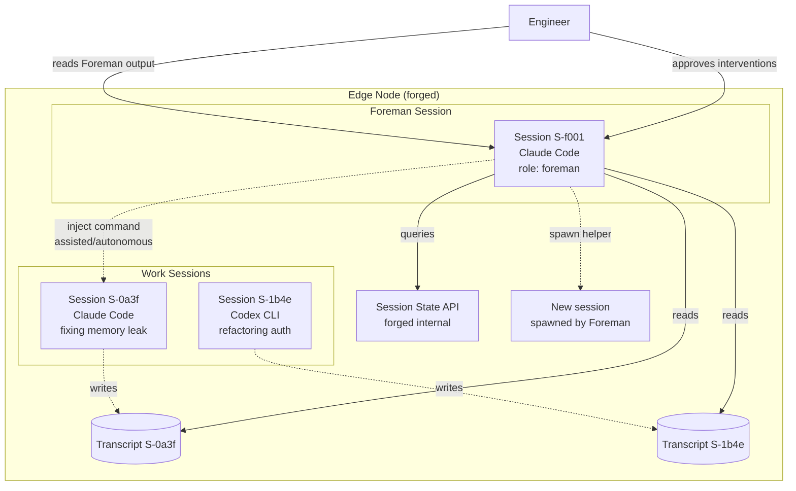

**Session role model:**

```rust
enum SessionRole {
    /// Standard work session — an engineer's agent
    Worker,
    /// Foreman session — supervises other sessions on this node
    Foreman {
        /// Sessions this Foreman is watching (empty = all on node)
        watch_scope: Vec<SessionId>,
        /// Maximum intervention level permitted
        intervention: InterventionLevel,
    },
}

enum InterventionLevel {
    /// Foreman observes and reports only
    Advisory,
    /// Foreman can propose commands; engineer approves before injection
    Assisted,
    /// Foreman can inject commands and spawn helper sessions autonomously
    Autonomous,
}
```

**How the Foreman reads other sessions:**

The Foreman does not parse tmux PTY streams directly. It reads from the same transcript files the sidecar writes to disk, and queries session state from forged's internal API. Concretely:

1. **Transcript files.** The Foreman's agent CLI is given read access to other sessions' transcript directories under the forged data directory. Its system prompt instructs it to periodically read new transcript content and reason about it.
2. **Session state.** The Foreman can query `forged` for structured session metadata (state, agent type, model, last activity, files touched) via a local Unix socket or a purpose-built CLI tool (`fmux status --format json`) run from within the Foreman's tmux session.
3. **File diffs.** For sessions working on git repositories, the Foreman can inspect `git diff` and `git log` in the repo directory to assess progress.

**How the Foreman acts on other sessions:**

| Intervention level | Mechanism |
|---|---|
| Advisory | Foreman writes findings to its own transcript; dashboard displays them. No cross-session interaction. |
| Assisted | Foreman produces a proposed command. Displayed in dashboard with an "Execute" button. On approval, `forged` injects the command into the target session's tmux input via `tmux send-keys`. |
| Autonomous | Foreman calls `fmux start` from within its own session to spawn helper sessions. Can also inject commands into watched sessions without approval. All actions logged. |

**Foreman system prompt structure:**

The Foreman is launched with a system prompt (passed to the agent CLI) that defines its role. The prompt is templated by `forged` at session start:

```
You are a Foreman agent supervising software development sessions on this edge node.

Your watched sessions: {{session_list}}
Transcript directory: {{transcript_dir}}

Your job:
1. Periodically read new transcript content from watched sessions.
2. For each session, assess: is it productive, blocked, looping, idle, or errored?
3. If a session appears stuck, diagnose the likely cause.
4. Produce a structured status report.
5. When you detect a stall, suggest a specific intervention.

Intervention level: {{intervention_level}}

{{#if autonomous}}
You may spawn helper sessions using: fmux start --agent claude --name "helper-{{session_id}}"
You may inject commands using: fmux inject {{session_id}} "command"
{{/if}}

Report format:
- Session ID
- Status: productive | blocked | looping | idle | errored
- Summary (1-2 sentences)
- Current hypothesis
- Files touched
- Suggested action (if blocked/looping)
```

**Foreman loop — what it does over time:**

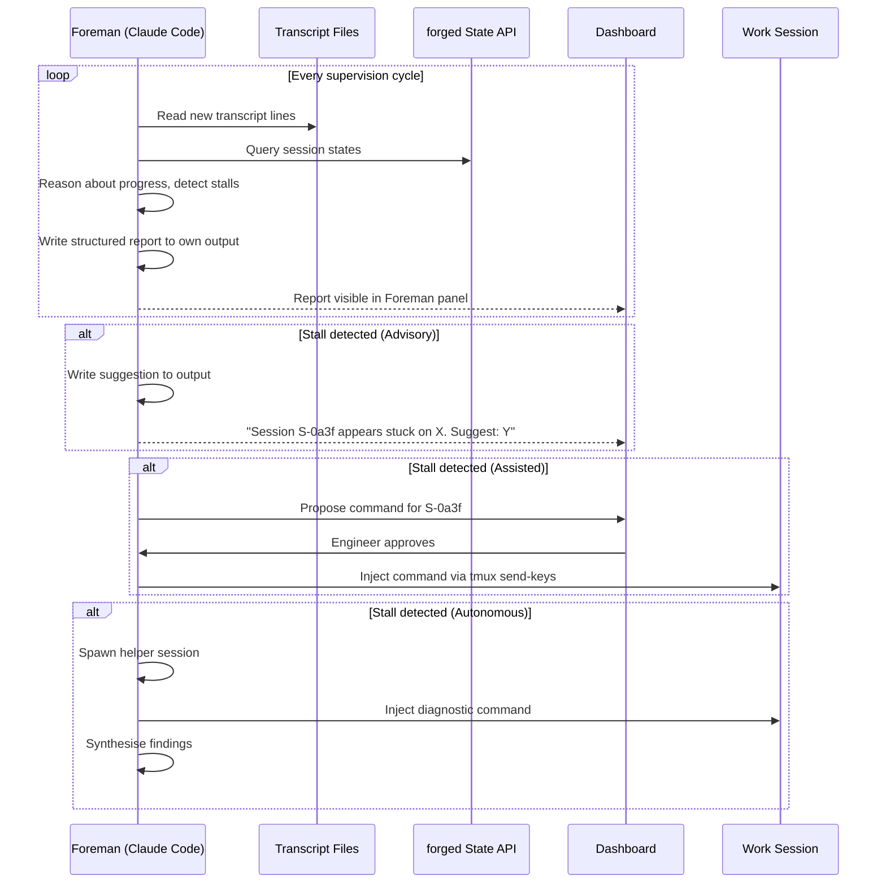

**Configuration:**

```toml
[foreman]
enabled = true
agent = "claude"
model = "sonnet"
intervention = "advisory"          # advisory | assisted | autonomous
watch_scope = "all"                # "all" or list of session IDs / patterns
cycle_interval = "5m"              # how often the Foreman reviews sessions
transcript_lookback = "500 lines"  # how much transcript to read per cycle
max_helpers = 3                    # max concurrent helper sessions (autonomous mode)
budget_warn_pct = 40               # warn when session hits N% of daily budget
```

**Safety constraints:**

- The Foreman never executes commands in work sessions without logging.
- In Advisory and Assisted modes, all interventions require engineer approval.
- In Autonomous mode, every injected command and spawned session is logged as a lifecycle event with `actor: foreman`.
- The Foreman cannot modify its own intervention level — only `forged.toml` or an admin can escalate it.
- The Foreman's own token usage is tracked and bounded. If it exceeds its budget, it downgrades to less frequent cycles rather than stopping entirely.

---

## Data Flow: Browser and Mobile Attach

### Design Principle

The session lives on the edge. Every client connection is ephemeral. Robustness means: reconnect, resume, never lose scrollback, never double-send input. tmux is the durability anchor — flaky networks only affect the web/mobile attach layer, never the agent session itself.

### Wire Protocol

The entire reliable stream layer is built on five message types:

```
RESUME(last_event_id, client_id)         Client → Edge
EVENT(event_id, ts, stream, bytes)       Edge → Client
INPUT(input_id, bytes, client_id)        Client → Edge
ACK(input_id, client_id)                 Edge → Client
SNAPSHOT(snapshot_id, event_id, data)    Edge → Client
```

This is sufficient to make browser and mobile attach reliable without modifying tmux.

### Connection Lifecycle

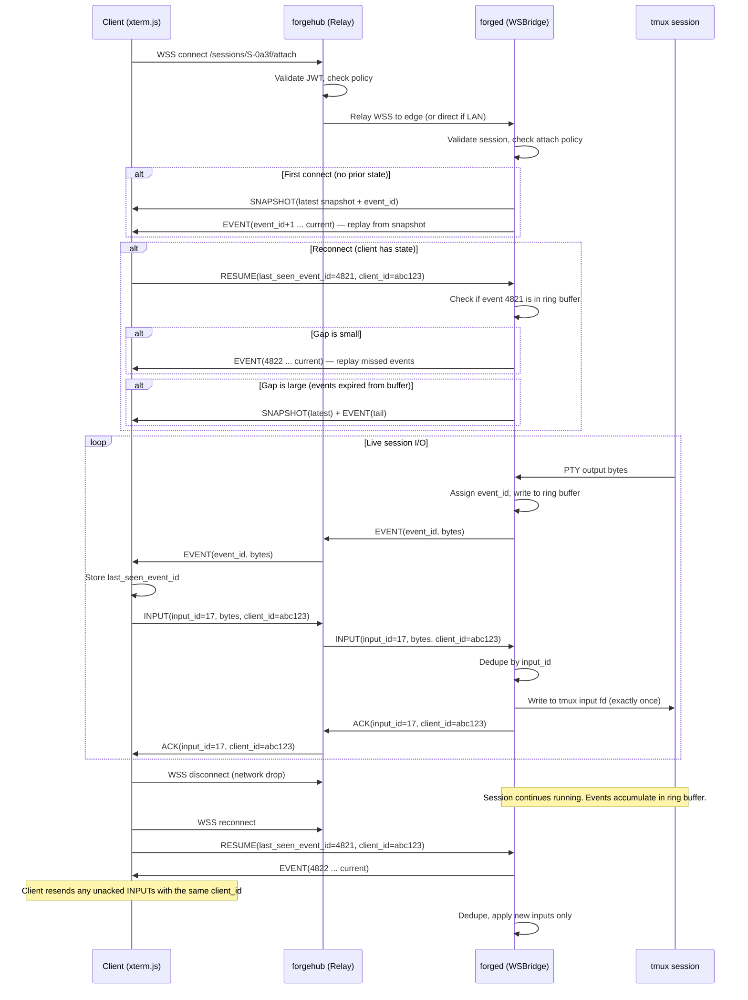

### Output Events and Replay

Every PTY output chunk becomes a sequenced event:

```rust
struct OutputEvent {
    event_id: u64,          // monotonic per session, never reused
    ts: DateTime<Utc>,
    stream: Stream,         // Stdout | Stderr
    data: Bytes,            // raw PTY bytes
}

struct Resume {
    last_seen_event_id: u64,
    client_id: String,      // stable per client across reconnects
}
```

The edge maintains a **ring buffer** per session (configurable size, default 8 MB / last 30 minutes). Events are also written to the transcript log on disk for long-term retention.

On reconnect:
1. Client sends `RESUME { last_seen_event_id }`
2. If the event is in the ring buffer → replay from that point
3. If the event has been evicted → send latest snapshot, then replay events after the snapshot's `event_id`

**Result: the client never misses output.** The worst case is a full-screen refresh from a snapshot, which takes milliseconds.

### Input Acknowledgement and Deduplication

Mobile reconnections cause "did my keystroke go through?" ambiguity. The protocol resolves this:

```rust
struct InputMessage {
    input_id: u64,          // monotonic per client_id
    client_id: String,      // stable per client across reconnects
    data: Bytes,            // keystrokes or line
}

struct InputAck {
    input_id: u64,
    client_id: String,
}
```

For every user input:
1. Client sends `INPUT(input_id, data)`
2. Edge applies it to the tmux PTY **exactly once**
3. Edge replies `ACK(input_id)`
4. Client marks the input as confirmed

On reconnect, the client resends all unacked inputs using the same `client_id`. The edge deduplicates by `(client_id, input_id)` — if it has already applied that input, it sends `ACK` without re-applying.

**Guarantee: at-most-once input delivery.** No double-sends, no lost keystrokes.

### Terminal Snapshots

Replaying 50,000 events after a long disconnect is slow. Snapshots solve this:

```rust
struct Snapshot {
    snapshot_id: u64,
    event_id_at_snapshot: u64,      // events after this are replayed
    data: SnapshotData,
}

enum SnapshotData {
    /// Last N lines of rendered terminal text (cheap, usually sufficient)
    ScrollbackText { lines: Vec<String>, cursor_row: u16, cursor_col: u16 },
    /// Full terminal state serialisation (expensive, pixel-accurate)
    TerminalState(Bytes),
}
```

Snapshots are captured periodically (every N seconds or M KB of output). Given tmux, the cheap approach — capturing the last 5,000–20,000 lines of rendered text via `tmux capture-pane` — is usually sufficient, but it does not preserve full terminal state (alternate screen, attributes). Use `TerminalState` for full fidelity when needed.

On reconnect with a large gap:
1. Edge sends `SNAPSHOT(latest)`
2. Client renders the snapshot (instant full-screen refresh)
3. Edge replays events after the snapshot's `event_id`
4. Client is caught up in milliseconds, not seconds

### Connection Modes

Browser and mobile have different needs:

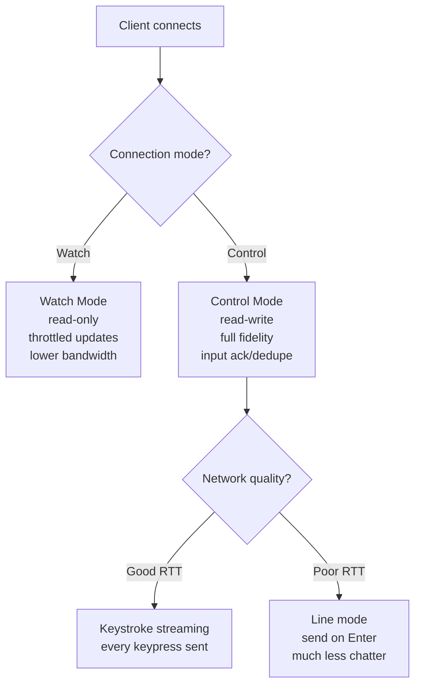

**Watch mode** (default on mobile): read-only attach with adaptive throttling. Output events are coalesced into larger batches (50–200ms). Update rate adapts to network conditions. Lower bandwidth, lower battery drain.

**Control mode**: read-write attach with full input ack/dedupe. Starts in keystroke streaming mode but degrades to line mode automatically when RTT exceeds a threshold.

### Hub Relay for Mobile Resilience

Direct-to-edge connections are fragile behind NAT and on mobile. The hub improves resilience:

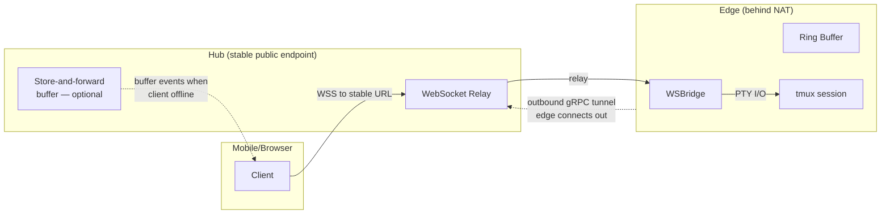

The edge maintains an **outbound** connection to the hub (edge connects out, so NAT is not an issue). The hub exposes a stable public endpoint. Mobile clients never need to reach the edge directly.

**Optional store-and-forward:** the hub can buffer output events while a client is disconnected. When the client reconnects, the hub replays buffered events before switching to live relay. This makes "edge temporarily offline" survivable for the client — the hub buffers both directions. Buffering is bounded by size/time limits similar to the edge ring buffer; beyond that, the client falls back to snapshot + tail.

### Bandwidth and Battery Optimisations

| Technique | Effect |
|---|---|
| **Chunk coalescing** | Merge tiny PTY writes into 50–200ms batches. Reduces message count by 10–50x. |
| **Compression** | Per-message deflate (WebSocket `permessage-deflate` extension). Effective on terminal output (highly compressible text). |
| **Backpressure** | If a client can't keep up, drop intermediate events but maintain the snapshot+tail path. Client gets a snapshot on next catch-up. |
| **Adaptive fidelity** | High RTT → switch to line-mode input automatically. Throttle render updates. |
| **Watch mode throttle** | Read-only clients receive updates at reduced rate (e.g., 2–5 fps equivalent). |

### Offline Command Queue

For intermittent connectivity (train, elevator, patchy mobile):

- Client allows user to queue commands while offline (line-mode only)
- UI shows "Queued N commands"
- On reconnect, queued commands are flushed as `INPUT` messages with sequential `input_id`s
- Edge applies them in order using standard ack/dedupe

Guardrails: offline queuing is only enabled when the session is in a "safe" state (waiting for input), or requires per-command approval from the user.

### Failure Guarantees (Explicit)

| Guarantee | Mechanism |
|---|---|
| **No output loss (within retention window)** | Output is replayable up to retention window (ring buffer + snapshot); beyond that, snapshot + tail |
| **At-most-once input** | Inputs applied exactly once via `input_id` deduplication |
| **Session continuity** | Agent continues running with zero clients attached |
| **Fast resume** | Snapshot + event tail ensures sub-second catch-up |
| **Graceful degradation** | Keystroke streaming → line mode under poor networks |
| **Offline resilience** | Command queue + flush on reconnect (line-mode, guarded) |

### Implementation Order

This layer ships incrementally within Phase 3 (Browser Attach):

| Step | What | Enables |
|---|---|---|
| 1 | Event IDs + ring buffer on edge | Foundation for all replay |
| 2 | `RESUME` handshake (`last_seen_event_id`) | Reconnect without losing output |
| 3 | `INPUT` ack + dedupe | Reliable input on flaky connections |
| 4 | Chunk coalescing + compression | Bandwidth reduction |
| 5 | Periodic snapshots (`tmux capture-pane`) | Fast catch-up after large gaps |
| 6 | Hub tunnel + optional store-and-forward | Mobile resilience behind NAT |
| 7 | Watch/Control modes + adaptive fidelity | Mobile-optimised experience |
| 8 | Offline command queue | Intermittent connectivity support |

Steps 1–3 are the minimum viable reliable stream. Steps 4–6 make it production-grade. Steps 7–8 are mobile-specific polish.

---

## Data Flow: Token Usage Tracking

Both Claude Code and Codex CLI write structured JSONL session logs to disk. The sidecar reads these files directly rather than parsing terminal output — this is more reliable, structured, and decoupled from TUI rendering changes.

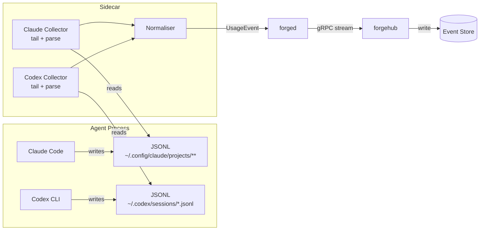

### Source: Claude Code

**Log locations:**

| Version | Path |
|---|---|
| v1.0.30+ | `~/.config/claude/projects/<project>/` |
| Legacy | `~/.claude/projects/<project>/` |

Claude Code organises logs by project (derived from the working directory / repo path). The sidecar maps the agent's `cwd` at session start to the correct project directory, then tails the JSONL files within it.

**What to extract:** Per-message or per-span usage records containing input tokens, output tokens, and cache tokens. Claude Code's `/cost` command reads the same underlying data, confirming the fields are present.

**Collector behaviour:**

1. At session start, resolve the project directory from the agent's `cwd`
2. Watch for new/modified JSONL files under both the new and legacy paths
3. Tail-parse each line, extracting usage records
4. Emit normalised `UsageEvent` per record

### Source: Codex CLI

**Log location:**

| Variable | Default |
|---|---|
| `$CODEX_HOME` | `~/.codex` |

Session logs are stored as `~/.codex/sessions/*.jsonl`. Each session produces one JSONL file. The sidecar identifies the active file by matching the newest file in the directory (or by session ID printed on agent start).

**What to extract:** Token accounting events (typically `token_count` event type) containing prompt tokens, completion tokens, and cached tokens. Codex's `/status` command displays this data in-session, confirming the event stream carries it.

**Known limitation:** Token usage events were not present in Codex CLI sessions before approximately September 2025. The collector must handle JSONL files that lack token fields gracefully — log a warning and report zero usage rather than failing.

**Collector behaviour:**

1. At session start, identify or create the mapping: tmux session ID → Codex session JSONL file
2. Tail-parse the JSONL file, filtering for token accounting events
3. Maintain rolling totals for prompt, completion, and cache tokens
4. Emit normalised `UsageEvent` periodically (on each new token event, or on a timer for batching)

### Normalised Event Schema

Both collectors emit a common structure:

```rust
struct UsageEvent {
    tmux_session_id: SessionId,
    agent: AgentType,           // Claude | Codex
    timestamp: DateTime<Utc>,
    prompt_tokens: u64,
    completion_tokens: u64,
    cache_tokens: Option<u64>,
    cost_estimate_usd: Option<f64>,
    source: UsageSource,        // LogFile | Estimated
}
```

### Session-to-Log Mapping

At session start, the sidecar records:

```rust
struct SessionUsageBinding {
    tmux_session_id: SessionId,
    agent: AgentType,
    cwd: PathBuf,
    start_ts: DateTime<Utc>,
    log_source: LogSource,
    // Resolved at start:
    // Claude: ~/.config/claude/projects/<project>/
    // Codex:  ~/.codex/sessions/<session>.jsonl
}

enum LogSource {
    ClaudeProject { path: PathBuf },
    CodexSession { path: PathBuf },
}
```

This binding is persisted alongside the session state so that usage collection can resume after a `forged` restart.

### Configuration

```toml
[agents.claude]
command = "claude"
args = ["--model", "sonnet"]
env = { ANTHROPIC_API_KEY_FILE = "/etc/forgemux/keys/anthropic.key" }
usage_collector = "claude-jsonl"
# Paths searched in order; first match wins
usage_paths = [
    "~/.config/claude/projects/",
    "~/.claude/projects/"
]

[agents.codex]
command = "codex"
args = []
env = { OPENAI_API_KEY_FILE = "/etc/forgemux/keys/openai.key" }
usage_collector = "codex-jsonl"
usage_paths = ["~/.codex/sessions/"]
# Codex sessions before this date may lack token data
usage_min_date = "2025-09-01"
```

---

## Security Architecture

```mermaid
graph TB
    subgraph Trust Boundaries
        subgraph Browser Zone
            BClient[Browser Client]
        end
        subgraph Hub Zone
            HubAPI[forgehub API]
            HubAuth[Auth Middleware<br/>JWT + RBAC]
        end
        subgraph Edge Zone
            EdgeDaemon[forged]
            subgraph Session Sandbox
                CGroup[cgroup v2 limits]
                NetNS[network namespace]
                FSBind[bind mount scope]
                AgentProc[Agent process]
            end
            subgraph Foreman Sandbox
                FM_CGroup[cgroup v2 limits]
                FM_Agent[Foreman agent]
                FM_Read[Read: transcripts<br/>session state]
                FM_Write[Write: tmux send-keys<br/>session spawn]
            end
            Creds[(Credentials<br/>API keys)]
        end
    end

    BClient -->|TLS + JWT| HubAuth
    HubAuth -->|validated| HubAPI
    HubAPI -->|mTLS| EdgeDaemon
    EdgeDaemon -->|spawns inside| CGroup
    EdgeDaemon -->|spawns inside| FM_CGroup
    EdgeDaemon -->|reads| Creds
    FM_Read -.->|read-only| Session Sandbox
    FM_Write -.->|controlled by<br/>intervention level| Session Sandbox
    Creds -.->|never leaves| Edge Zone
```

**Credential isolation.** API keys and tokens are stored on the edge node and injected into the agent's environment at session start. They are never transmitted to the hub or exposed via any API endpoint.

**Session sandboxing.** Each agent session runs inside a cgroup v2 slice with configurable CPU, memory, and I/O limits. Network namespaces can restrict agent network access. Filesystem access is scoped via bind mounts.

**Foreman boundaries.** The Foreman runs in its own sandbox with its own resource limits. It has read access to other sessions' transcripts and state, but write access (command injection, session spawning) is gated by the configured intervention level. The Foreman cannot escalate its own intervention level — only configuration changes by an admin can do so. All Foreman actions are logged as lifecycle events with `actor: foreman`.

**Transport encryption.** All hub-to-edge communication uses mutual TLS (mTLS). Browser-to-hub communication uses TLS with JWT authentication. SSH access uses existing key infrastructure.

---

## Configuration

### CLI — `~/.config/forgemux/config.toml`

```toml
# Default: all commands route through the hub
hub_url = "https://hub.internal:9443"

# Named edge aliases for direct mode (--edge mel-01)
[edges]
mel-01 = "edge-mel-01.tailnet:9443"
mel-02 = "edge-mel-02.tailnet:9443"
lab     = "192.168.1.50:9443"

[tls]
ca = "~/.config/forgemux/ca.crt"          # CA to verify hub and edge certs
client_cert = "~/.config/forgemux/client.crt"  # mTLS client identity (optional)
client_key  = "~/.config/forgemux/client.key"
```

### Edge daemon — `/etc/forgemux/forged.toml`

```toml
[node]
id = "edge-mel-01"
hub_url = "https://hub.internal:9443"
data_dir = "/var/lib/forgemux"

# Address the hub advertises to CLI clients for direct-connect fallback
# and that the hub uses to relay browser WebSocket connections
advertise_addr = "edge-mel-01.tailnet:9443"

# gRPC listen address for direct CLI connections and hub relay
listen_addr = "0.0.0.0:9443"

# Registration: forged connects to hub on startup and maintains
# a persistent gRPC stream. Hub adds this node to its edge registry.
[hub_registration]
heartbeat_interval = "10s"
reconnect_backoff_max = "60s"

[tls]
cert = "/etc/forgemux/certs/edge.crt"
key = "/etc/forgemux/certs/edge.key"
ca = "/etc/forgemux/certs/ca.crt"

[sessions.defaults]
idle_timeout = "30m"
max_sessions = 10
transcript_retention = "30d"

[sessions.limits]
cpu_shares = 1024
memory_max = "4G"
pids_max = 256

[agents.claude]
command = "claude"
args = ["--model", "sonnet"]
env = { ANTHROPIC_API_KEY_FILE = "/etc/forgemux/keys/anthropic.key" }
usage_collector = "claude-jsonl"
usage_paths = [
    "~/.config/claude/projects/",
    "~/.claude/projects/"
]

[agents.codex]
command = "codex"
args = []
env = { OPENAI_API_KEY_FILE = "/etc/forgemux/keys/openai.key" }
usage_collector = "codex-jsonl"
usage_paths = ["~/.codex/sessions/"]
usage_min_date = "2025-09-01"

[websocket]
bind = "0.0.0.0:8080"
max_connections = 50

# Reliable stream protocol
event_ring_buffer_size = "8MB"      # per-session ring buffer for event replay
event_ring_time_limit = "30m"       # evict events older than this
snapshot_interval = "30s"           # terminal snapshot frequency
snapshot_lines = 5000               # lines to capture per snapshot
input_dedup_window = 1000           # track last N input_ids for dedup

# Bandwidth optimisation
chunk_coalesce_ms = 100             # batch PTY writes into N ms windows
compression = true                  # permessage-deflate on WebSocket
watch_mode_fps = 3                  # update rate for read-only clients
line_mode_rtt_threshold_ms = 300    # switch to line-mode input above this RTT
```

---

## Crate Dependency Summary

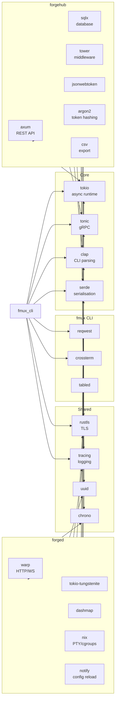

---

## Project Structure

```
forgemux/
├── Cargo.toml                  # workspace root
├── crates/
│   ├── forgemux-cli/           # engineer CLI binary (produces `fmux`)
│   │   └── src/
│   │       ├── main.rs
│   │       ├── resolve.rs      # edge resolution (alias → address, hub fallback)
│   │       └── commands/       # one module per subcommand group
│   │           ├── start.rs
│   │           ├── attach.rs
│   │           ├── stop.rs
│   │           ├── ls.rs
│   │           ├── logs.rs
│   │           ├── status.rs
│   │           ├── usage.rs
│   │           └── edges.rs
│   ├── forged/                 # edge daemon binary
│   │   └── src/
│   │       ├── main.rs
│   │       ├── commands/       # CLI subcommands (run, check, drain, etc.)
│   │       ├── lifecycle.rs    # session create/destroy/state machine
│   │       ├── session.rs      # session state and map
│   │       ├── pty.rs          # PTY capture and ring buffer
│   │       ├── ws_bridge.rs    # WebSocket ↔ tmux bridge with reliable stream protocol
│   │       ├── event_ring.rs  # per-session monotonic event ring buffer
│   │       ├── snapshot.rs    # periodic terminal snapshot via tmux capture-pane
│   │       ├── input_dedup.rs # input_id tracking and at-most-once delivery
│   │       ├── policy.rs       # cgroup, namespace, limits
│   │       ├── transcript.rs   # transcript writer
│   │       ├── metrics.rs      # metrics collection and reporting
│   │       ├── hub_client.rs   # hub registration and heartbeat
│   │       ├── foreman.rs     # Foreman session lifecycle, prompt templating, intervention dispatch
│   │       └── usage_collectors/ # per-agent JSONL log parsers (claude-jsonl, codex-jsonl)
│   ├── forgehub/               # hub server binary
│   │   └── src/
│   │       ├── main.rs
│   │       ├── commands/       # CLI subcommands (run, check, db, token, etc.)
│   │       ├── api.rs          # REST endpoints
│   │       ├── grpc.rs         # edge daemon connections
│   │       ├── ws_relay.rs     # browser → edge WebSocket relay + optional store-and-forward
│   │       ├── aggregator.rs   # cross-node state aggregation
│   │       ├── registry.rs     # edge node registry
│   │       ├── auth.rs         # JWT, API tokens, and RBAC
│   │       ├── reporting.rs    # usage aggregation and export
│   │       └── db/             # migrations, queries
│   └── forgemux-proto/         # shared protobuf definitions
│       └── proto/
│           ├── session.proto
│           ├── metrics.proto
│           ├── control.proto
│           └── stream.proto    # RESUME, EVENT, INPUT, ACK, SNAPSHOT wire types
├── dashboard/                  # SPA frontend (TypeScript)
│   ├── src/
│   └── package.json
└── deploy/
    ├── forged.service          # systemd unit for edge daemon
    ├── forgehub.service        # systemd unit for hub server
    └── forged.toml.example     # example configuration
```

---

## Build and Deploy

**Build all binaries:**

```bash
cargo build --release --workspace
```

**Outputs:**

- `target/release/fmux` — copy to engineer workstations
- `target/release/forged` — deploy to edge nodes
- `target/release/forgehub` — deploy to hub server

The `fmux` binary name is set in the crate's `Cargo.toml`:

```toml
# crates/forgemux-cli/Cargo.toml
[package]
name = "forgemux-cli"

[[bin]]
name = "fmux"
path = "src/main.rs"
```

**Edge node setup:**

```bash
# Install binary
sudo cp forged /usr/local/bin/
sudo cp deploy/forged.service /etc/systemd/system/
sudo mkdir -p /etc/forgemux/certs /etc/forgemux/keys /var/lib/forgemux

# Configure
sudo cp deploy/forged.toml.example /etc/forgemux/forged.toml
# Edit config, place certs and API keys

# Start
sudo systemctl enable --now forged
```

---

## Open Technical Questions

1. **tmux interaction method.** Shell out to `tmux` CLI vs. speak the tmux control protocol directly over a Unix socket. CLI is simpler and avoids ABI coupling; control protocol is lower latency and avoids fork overhead. Recommend starting with CLI, benchmarking, and migrating if needed.

2. **Hub store-and-forward depth.** The hub can optionally buffer events while a client is disconnected. How deep should this buffer be? Should it persist across hub restarts (disk-backed), or is in-memory sufficient? Deep buffering adds complexity but makes edge outages transparent.

3. **Usage collector resilience.** Both Claude Code and Codex CLI may change their JSONL schemas across versions. The collector should degrade gracefully — log a warning and emit zero-usage events rather than crashing. Should we version-detect the agent CLI at session start and select a schema-aware parser, or rely on defensive parsing with optional fields?

4. **Transcript storage format.** Raw terminal bytes with timestamps (faithful replay) vs. stripped ANSI (searchable text) vs. both. Storage implications for long-running sessions.

5. **Cgroup delegation.** Requires systemd delegation or root privileges on the edge node. Need to define the minimum privilege model for `forged` — run as root, or use systemd's `Delegate=yes` with a dedicated user.

6. **Foreman transcript access pattern.** The Foreman reads other sessions' transcripts by file. For long-running sessions, transcripts may be very large. Should the Foreman read only a rolling tail (last N lines), or should `forged` provide a summarised / chunked view? If the Foreman manages its own sliding window via its system prompt, transcript files may need an efficient seek-to-offset capability.

7. **Foreman stall detection accuracy.** The Foreman uses an LLM to classify session state (productive, blocked, looping). False positives (flagging a productive session as stuck) are annoying; false negatives (missing a stalled session) defeat the purpose. How should we measure and tune this? Consider a calibration period where Foreman reports are compared against engineer assessments.

8. **Foreman command injection safety.** In Assisted and Autonomous modes, the Foreman injects commands into tmux via `send-keys`. This is powerful but risky — a malformed command could disrupt a session. Should we require commands to be validated against an allowlist, or is full audit logging sufficient?

---

*This document is intended for Silverpond engineering. It defines the technical architecture for Forgemux to guide implementation planning and review.*
